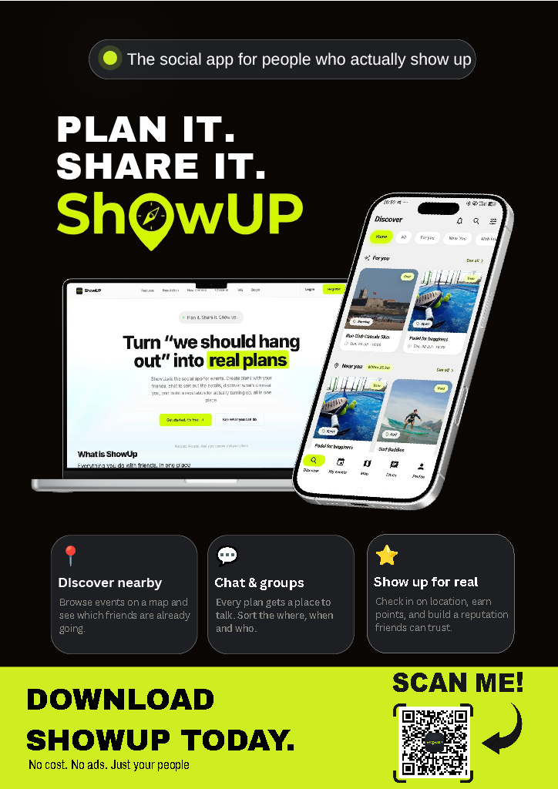

# ShowUp

### Turn *"we should hang out"* into real plans.

Discover events near you, create your own, invite friends, chat, and
**check in when you physically arrive** — ShowUp rewards the people who
actually *show up*, not just the ones who tap "going".

## Comercial Video:

## Final Presentation
📊 [Download the presentation (PPTX, 204MB)](https://github.com/Alvesss04/ShowUP/releases/download/ShowUP/your-file.pptx)
🎨 [View the presentation on Canva](https://canva.link/jefsxytqu7azb9j)

---

  # Tech Stack

| Layer              | Technology                                                  |
| ------------------ | ----------------------------------------------------------- |
| Backend API        | Java 21, JAX-RS (Jersey) on Google App Engine (Jetty 12)    |
| Auth               | Firebase Authentication — ID tokens, roles as custom claims |
| Database           | Google Cloud Datastore                                      |
| File storage       | Google Cloud Storage (photos)                               |
| Image moderation   | Google Cloud Vision (SafeSearch)                            |
| Realtime chat      | Cloud Firestore                                             |
| Push notifications | Firebase Cloud Messaging                                    |
| Web client         | React + TypeScript + Vite, plus static HTML pages           |
| Mobile client      | Flutter                                                     |

---

## ✨ Main Project Features!

### Accounts, auth & roles

Its possible to Sign up with email/password or Google. You also have roles for each type of account.

| Role         | What it is                                                        |
| ------------ | ----------------------------------------------------------------- |
| `USER`       | A normal person                                                   |
| `ENTERPRISE` | A company/venue that runs official events (requires verification) |
| `BOFFICER`   | Back-office staff — moderation powers                             |
| `ADMIN`      | Full staff powers                                                 |

### Events

The core of the app. Anyone can create an event — name, a place on the map, a
date, a capacity, and a cover photo. There are two kinds: **user events**
(community plans, with a group chat) and **enterprise events** (official events
from verified companies, with tickets/price/links). 
There is also roles for events -
moderator(full acess), member(invite only) and guest(no permissions).

This is how a **non-member joins** each kind of event:

| Event                   | How you get in                                                          |
| ----------------------- | ----------------------------------------------------------------------- |
| **User · Public**       | **Request** to join — the host approves (a full one becomes a waitlist) |
| **User · Private**      | **Invite** only                                                         |
| **Enterprise · Open**   | **Join instantly**                                                      |
| **Enterprise · Locked** | **Invite** only                                                         |

What you can do to bring others in — and how you join — depends on your role and
the event's setting.

**User events** (set to public or private) - Always goes by an creator or moderator (aproval)

| Setting     | User (member) | Creator | Moderator | Guest |
| ----------- | :-----------: | :-----: | :-------: | :---: |
| **Public**  |     Invite    |  Invite |   Invite  | Can't |
| **Private** |    Suggest    |  Invite |   Invite  | Can't |

**Enterprise events** (always public — access is controlled by a *lock*, not by privacy)

| Setting    | User (member) | Creator | Moderator | Guest |
| ---------- | :-----------: | :-----: | :-------: | :---: |
| **Open**   |     Invite    |  Invite |   Invite  | Can't |
| **Locked** |     Can't     |  Invite |   Invite  | Can't |

> Suggestions are a private-event feature, so they don't apply to enterprise events.

### Check-in

An event isn't "attended" until you're actually there. Within a window around the
start time and **within 500 m** of the event's coordinates, attendees tap **Check
in**; the app verifies their GPS position against the venue. Only people who check
in count as attended and earn points.

### Invites & suggestions

Hosts (and staff) can invite specific people; members can suggest friends for the
host to invite. Accepting an invite joins instantly for host/staff invites, or
becomes a join request otherwise.

### Friends & following

Friends is a mutual relationship (request → accept) used to see what your circle is
going to. Following is one-directional and aimed at enterprises, so you get their
new official events.

### Chat & messaging

Every user event has a group chat, plus one-on-one messaging. Messages are stored
in Datastore and mirrored to Firestore so clients get realtime updates. Pictures
can be shared (moderated like every other upload).

### Notifications

Invites, join requests, replies, event updates, and check-in confirmations produce
notifications. Text is pre-rendered at write time; an unread counter and a
"seen" watermark drive the bell. Device tokens enable push notifications.

### Leaderboard, points, badges & ratings

The gamification layer. Checking in to finished events earns **points** (with
anti-farming rules), which feed a **leaderboard**. Attendance builds a **reputation**;
participants can rate each other after an event, and milestones unlock **badges**.

### Reports & moderation (staff / Admin)

Users report events, messages, or people. Staff (`ADMIN` / `BOFFICER`) review the
queue and can **ban**, **suspend** (temporary), **mute**, or **block event/photo
creation** for a user, maintain a **banned-words** profanity list, and every staff
action is logged for audit. There's also a photo-block appeal flow.

### Enterprise verification

Companies submit documents (name, NIF, address, proof files) and stay locked out
of event features until staff approve them.

### Photos & content safety

Every public-facing upload (profile pictures, event covers, chat pictures) is
hardened and moderated: magic-byte checks, re-encoding to strip hidden payloads,
a size/dimension cap, per-user rate limits, and — where enabled — Cloud Vision
SafeSearch. Repeated unsafe uploads auto-trigger a temporary photo block.

### Search, statistics & scheduled jobs

- **Search** — find events by name/category
- **Statistics** — platform metrics dashboard
- **Cron** — auto-finish past events, lift expired suspensions, and other upkeek.
- **App download** — serve the mobile APK.

  ## 👥 Team
 
| Name | GitHub |
|---|---|
| Tomás Alves | [@Alvesss04](https://github.com/Alvesss04) |
| Tiago Poeira | |
| Manuel Figueiredo | |
| Francisco Figueiredo | |
| Miguel Morão | |

 
## 🖼️ Poster
 

## 📄 License
 
Copyright © 2026 **FiveGuysFCT**. All Rights Reserved.
 
This project, including its source code, documentation, presentation materials, and video content, was created by the authors listed above. Unauthorized copying, distribution, modification, or use of this project, in whole or in part, without the express written permission of the authors is strictly prohibited.
 

Made with ❤️ by FiveGuysFCT
 

